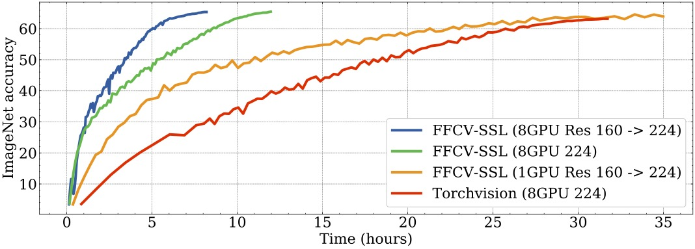

<p align = 'center'>
<h1><b>Fast Forward Computer Vision for Self-Supervised Learning</b></h1>

`FFCV-SSL` is a fork of the [FFCV library](https://github.com/libffcv/ffcv) with an added support of Self-Supervised training. In this fork, you can find the traditional data augmentations used in SSL but also several improvements to handle multiple views of a given image and examples on how to train well-known SSL methods like SimCLR. Here is an example of the performances, one can get on SimCLR using FFCV-SSL:



Please refer to the original [FFCV library](https://github.com/libffcv/ffcv) to generate the dataset .beton files.

# Installation
```
conda create -y -n ffcv-ssl python=3.9 cupy pkg-config compilers libjpeg-turbo opencv pytorch torchvision torchaudio pytorch-cuda=11.7 numba -c pytorch -c nvidia -c conda-forge
conda activate ffcv-ssl
pip install -e .
```
Troubleshooting note: if the above commands result in a package conflict error, try running ``conda config --env --set channel_priority flexible`` in the environment and rerunning the installation command.

# What's new <a name="introduction"></a>

- *Multi views* FFCV-SSL is able to return an arbitraty number of different view of a given field with different pipelines.
- *More augmentations*: Data augmentations is crucial for methods like Self-supervised learning, in this fork we add ColorJitter, Solarization, Grayscale, Rotation.. 
- *Seeding** Being able to fix the seed of a given transformation is important for reproducibility
- *Data augmentations parameters* In this fork you can get label pipelines that will return the parameters of the data augmentations that are used.

# How to train SimCLR using FFCV-SSL
Clone and install this repository, then use:
```
python examples/train_ssl.py --config-file examples/rn50_configs/rn50_baseline.yaml --data.train_dataset=YOUR_TRAIN_DATA.beton --data.val_dataset=YOUR_VAL_DATA.beton --data.num_workers=10 --data.in_memory=1 --logging.folder YOUR_CHECKPOINT --training.batch_size 32 --training.epochs 100 --model.remove_head 0 --model.mlp 8192-8192-8192 --model.fc 0 --model.proj_relu 0 --training.loss simclr --dist.use_submitit 0 --training.optimizer adamw --training.base_lr 0.0005 0
```
This script allow also the use of submitit which can generate a sbatch file to send this job on a SLURM cluster. To activate submit, you just need to add the argument '--dist.use_submitit 1'. This script support other SSL loss such that VicReg/Barlow Twins and Byol. To use other loss, you'll just need to replace '--training.loss simclr' by '--training.loss vicreg'.

# Multiview augmentation e.g. for SSL<a name="multiview"></a>
To run the examples, you'll need to setup the following environment variable: 
```
export FFCV_DATAT_PATH=YOUR_PATH
```
to the path of your ffcv beton file.

Then you can try [this code](./examples/test_ffcv_augmentations_ssl.py). We show how to produce three views from a dataset generated with only two fields: `image` and `label`. In short, we use the loader's `custom_field_mapper` argument to give a dictionnary mapping the extra given pipelines to the ones present in the saved dataset.

# `ffcv` seeding <a name="seeding"></a>
 
For seeding, you can try [this code](./examples/test_ffcv_augmentations_seeding.py) located in the examples folder.
By default the loader and DAs have a `None` seed i.e. different runs have different data ordering and augmentaiton realizations as shown below for a mini-batch size of 3 on Imagenet only with random crop and translation as DAs. For reproducibility we enable seed specification for both the loader and each DA leading to the follow where both are set.

# Return the parameters of a Data Augmentation<a name="params_DA"></a>

You can find a working example in [this code](./examples/ffcv_test_cropping_with_labels.py). To get the parameters of a crops, i.e the bounding boxe used to extract the crop, you can use *seeding* in addition of a labelling pipeline. Here is an example of such pipeline where we fixe the seed to 5:

```
    image_pipeline = [
        ffcv.transforms.RandomResizedCrop(
            output_size=(224, 224), ratio=(0.4, 1.0), seed=5, scale=(0.08, 1.0)
        ),
        ToTensor(),
        ToDevice(ch.device('cuda:0'), non_blocking=True),
        ToTorchImage(),
        NormalizeImage(IMAGENET_MEAN, IMAGENET_STD, np.float16),
        ]

```
And the corresponding label pipeline:
```
    label_crops_pipeline = [
        ffcv.transforms.LabelRandomResizedCrop(
            output_size=(224, 224),
            ratio=(0.4, 1.0),
            seed=5,
            scale=(0.08, 1.0),
        ),
        ToTensor(),
        Squeeze(),
        ToDevice(ch.device("cpu"), non_blocking=True)
    ]
```
In order to get parameters that are consistent with the transformations applied on the images, it's really important that both the Image and Label pipeline get the exact same parameters with the same seed. Furthermore, when creating the DataLoader, you should specify a custom fiel mapper with the label_crops_pipeline on the image (which is important to get the original width/height size of the image) such as:
```
custom_field_mapper={"crop_parameters": "image"}
```


## Citation
If you use FFCV-SSL, please cite it as:

```

@misc{bordes2023ffcv_ssl,
  doi = {10.48550/ARXIV.2303.01986},
  url = {https://arxiv.org/abs/2303.01986},
  author = {Bordes, Florian and Balestriero, Randall and Vincent, Pascal},
  keywords = {Machine Learning (cs.LG), FOS: Computer and information sciences, FOS: Computer and information sciences},
  title = {Towards Democratizing Joint-Embedding Self-Supervised Learning},
  publisher = {arXiv},
  year = {2023},
  copyright = {arXiv.org perpetual, non-exclusive license}
}

@misc{leclerc2022ffcv,
    author = {Guillaume Leclerc and Andrew Ilyas and Logan Engstrom and Sung Min Park and Hadi Salman and Aleksander Madry},
    title = {ffcv},
    year = {2022},
    howpublished = {\url{https://github.com/libffcv/ffcv/}},
    note = {commit xxxxxxx}
}
```
(Make sure to replace xxxxxxx above with the hash of the commit used!)

## License

This project is released, as the original repository, under Apache 2.0 License. See [LICENSE](LICENSE) for details.
