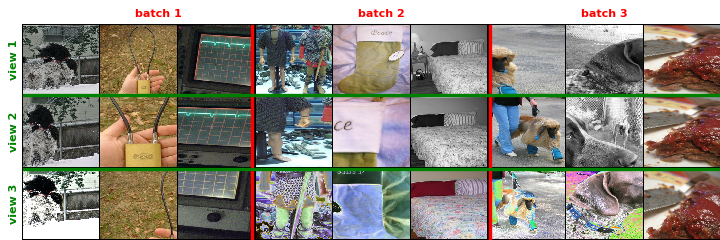

<p align = 'center'>
<h1><b>Fast Forward Computer Vision for Self-Supervised Learning</b></h1>

`ffcv` is a fork of the [FFCV library](https://github.com/libffcv/ffcv) with an added support of Self-Supervised training. In this fork, you can find the traditional data augmentations used in SSL but also several improvements to handle multiple views of a given image and examples on how to train well-known SSL methods like SimCLR. Here is an example of the performances, one can get on SimCLR using FFCV-SSL:


# Installation
```
conda create -y -n ffcv-ssl python=3.9 cupy pkg-config compilers libjpeg-turbo opencv pytorch torchvision torchaudio pytorch-cuda=11.7 numba -c pytorch -c nvidia -c conda-forge
conda activate ffcv-ssl
pip install -e .
```
Troubleshooting note: if the above commands result in a package conflict error, try running ``conda config --env --set channel_priority flexible`` in the environment and rerunning the installation command.

# What's new <a name="introduction"></a>

- *More augmentations*: Data augmentations is crucial for methods like Self-supervised learning, in this fork we add ColorJitter, Solarization, Grayscale, Rotation.. 
- *Seeding** Being able to fix the seed of a given transformation is important for reproducibility
- *Data augmentations parameters* In this fork you can get label pipelines that will return the parameters of the data augmentations that are used.
- *Multi views* FFCV-SSL is able to return an arbitraty number of different view of a given field with different pipelines.

# `ffcv` seeding <a name="seeding"></a>
 
To reproduce those figures, please run [this code](./examples/test_ffcv_augmentations_seeding.py) located in the examples folder.
By default the loader and DAs have a `None` seed i.e. different runs have different data ordering and augmentaiton realizations as shown below for a mini-batch size of 3 on Imagenet only with random crop and translation as DAs. 
For reproducibility we enable seed specification for both the loader and each DA leading to the follow where both are set


DAs and loader with seed=None             |  DAs and loader with seed=0
:-------------------------:|:-------------------------:
 |  


which allows for fine-control e.g. setting only the seed of the DA to `0` leaves the data ordering independent between runs

DAs with seed=0             |  DAs with seed=1
:-------------------------:|:-------------------------:
 |  


and conversely setting only the seed of the loader leaves the DA independent between runs
which again can be modified by hand to manually change the data ordering as seen comparing the below figures
loader with seed=0             |  loader with seed=1
:-------------------------:|:-------------------------:
 |  


# `ffcv.transforms.image`<a name="image_augs"></a>

All the plots here use the same seed for the data-augmentations hence the same realisation. To reproduce those figures use [this code](../examples/test_ffcv_augmentations_families.py).

*RandomCropResized* with loader seed=None             |  with loader seed=0
:-------------------------:|:-------------------------:
 |  


*RandomColorJitter* with loader seed=None             |  with loader seed=0
:-------------------------:|:-------------------------:
 |  


*RandomErasing* with loader seed=None             |  with loader seed=0
:-------------------------:|:-------------------------:
 |  


*RandomTranslation* with loader seed=None             |  with loader seed=0
:-------------------------:|:-------------------------:
 |  


*RandomSolarization* with loader seed=None             |  with loader seed=0
:-------------------------:|:-------------------------:
 |  


*RandomGrayscale* with loader seed=None             |  with loader seed=0
:-------------------------:|:-------------------------:
 |  

*RandomHorizontalFlip* with loader seed=None             |  with loader seed=0
:-------------------------:|:-------------------------:
 |  

*RandomVerticalFlip* with loader seed=None             |  with loader seed=0
:-------------------------:|:-------------------------:
 |  

*RandomInvert* with loader seed=None             |  with loader seed=0
:-------------------------:|:-------------------------:
 |  


# Multiview augmentation e.g. for SSL<a name="multiview"></a>

To reproduce those figures use [this code](../examples/test_ffcv_augmentations_ssl.py). We show how to produce three views from a dataset generated with only two fields: `image` and `label`. In short, we use the loader's `custom_field_mapper` argument to give a dictionnary mapping the extra given pipelines to the ones present in the saved dataset. In this case we also control the seed of the grayscale augmentation so that it is the same realisations between `view1` and `view2`, leading to the below plot:




## License

This project is released, as the original repository, under Apache 2.0 License. See [LICENSE](LICENSE) for details.
